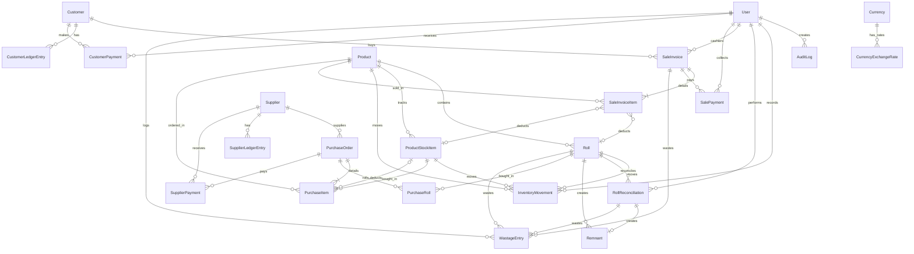

<div align="center">
  
</div>

<div align="center">

# TextilePOS

### *The Open-Source Textile ERP & POS system designed exclusively for fabric stores, resolving the continuous, variable-measurement inventory problem that breaks generic retail software.*

[](LICENSE)
[](https://www.typescriptlang.org/)
[](https://nestjs.com/)
[](https://react.dev/)
[](https://tailwindcss.com/)
[](https://www.prisma.io/)
[](https://www.mysql.com/)

[**Explore Docs**](file:///docs) • [**Report a Bug**](https://github.com/mmd-rehan/textile-pos/issues) • [**Request Feature**](https://github.com/mmd-rehan/textile-pos/issues) • [**Contribute**](#-contributing)

</div>

---

## 🧵 The Core Problem

Standard retail POS and ERP systems are built around a simple assumption: **discrete, countable units**. Selling 1 shirt, 3 mugs, or 12 bottles maps cleanly onto integer-based inventory counts. 

**Fabric and textile retail does not work this way.**

In a textile shop, inventory arrives in rolls (*Thaan*) of varying lengths (e.g., 30 yards). Fabric is cut and sold in variable, fractional lengths driven entirely by the customer's need: 3.2 yards for a suit, 5.5 meters for curtains, or 0.75 yards for a patch. This introduce a cascade of unique operational problems:

| Problem | Why Standard POS Fails | How TextilePOS Solves It |
| :--- | :--- | :--- |
| **Fractional Deductions** | Only supports whole-number quantities; floats introduce rounding errors. | Employs decimal-safe tracking to deduct exact fractional lengths (e.g., `3.25` yards) from a roll's running balance. |
| **Measurement Duality** | Rigid base units make conversions inaccurate and slow. | Supports dual-unit entry with automatic conversion (e.g., Yards ↔ Meters) per roll, maintaining exact balances. |
| **Dye-Lot & Batch Tracking** | Assumes same SKU means identical items. | Tracks stock at the `(Product, DyeLot, Roll)` grain to prevent selling mismatched color variants to the same customer. |
| **Roll Reconciliation** | Minor cutting errors build up, leaving ghost inventory. | Includes a structured reconciliation flow to retire exhausted rolls and log physical vs. system variances as shrinkage. |
| **Remnant Management** | Leftover scraps are either lost or sold at full price. | Automatically flags leftover scraps (e.g., under 2 yards) as remnants, applying separate discount and clearance workflows. |

---

## ✨ Features

- ⚡ **Continuous Fractional Ledger** — Accurate, append-only tracking of fabric lengths up to 4 decimal places with strict type validation.
- 🔄 **Real-time Unit Conversion** — Seamlessly intake rolls in meters and sell in yards, or vice-versa, with exact math.
- 🏷️ **Roll-level Barcode Generation** — Generate and print unique barcodes for each physical roll, linking it to its specific dye-lot, wholesale cost, and remaining length.
- 💱 **Multi-Currency Purchase Orders** — Document purchases from global suppliers in multiple currencies (USD, AED, EUR, PKR, etc.) while storing base-currency snapshots for inventory valuation.
- 📑 **Dual Sales POS (Retail vs. Wholesale)** — Separate interfaces and workflows optimized for fast retail scanning (with cash/discount modes) and bulk wholesale transactions (with customer ledger credit accounts).
- 📉 **Wastage & Shrinkage Tracking** — Track salesman cutting errors and roll end-of-life discrepancies, identifying where losses occur.
- 💳 **Udhaar (Credit) & Supplier Ledger** — Simple, append-only double-entry bookkeeping ledger to track credit customers and outstanding supplier balances.
- 🖨️ **Zero-Driver Thermal Printing** — Print standard 80mm thermal receipts directly from the browser using pure CSS `@media print` rules, optimized for fast checkout.
- 🔌 **HID Barcode Scanner Support** — Seamlessly handles USB/Bluetooth HID scanners without configuration by listening to browser keyboard streams.

---

## 🏛️ Architecture & Core Concepts

### 1. The Roll (Thaan) is the Atom of Inventory
In TextilePOS, inventory is **never** tracked solely at the product level. The **Roll (Thaan)** is the source of truth because every roll represents a physically distinct piece of fabric with its own batch number, dye lot, purchase cost, and remaining length.

```
Category (e.g., Fabric)
   └── Product (e.g., Lawn Summer Print)
         └── Batch / Dye Lot (e.g., Lot-24B)
               ├── Roll #1 (Thaan) -> 24.5 Yards Left
               └── Roll #2 (Thaan) -> 12.2 Yards Left
```

### 2. Product Types Supported
The system adapts its POS and purchase screens dynamically based on the product type:
- 🧵 **Variable-Length Fabric (`FABRIC_ROLL`)**: Sold in yards/meters from a specific roll barcode.
- ✂️ **Cut Pieces (`CUT_PIECE`)**: Pre-cut suits or fabrics sold by the piece/unit.
- 📦 **Fixed Products (`FIXED_PRODUCT`)**: Countable inventory (e.g., buttons, zippers, shawls) sold by the piece.

---

## 📊 Database Schema (Prisma ERD)

Below is the database relationship model. All transactions, stock movements, and ledgers are append-only to ensure complete auditing safety.



---

## 🛠️ Tech Stack

- **Frontend**: [React 18](https://react.dev/) + [Vite](https://vitejs.dev/) + [TypeScript](https://www.typescriptlang.org/) + [Tailwind CSS](https://tailwindcss.com/)
- **Backend**: [Node.js](https://nodejs.org/) + [NestJS](https://nestjs.com/) + [TypeScript](https://www.typescriptlang.org/)
- **Database**: [MySQL 8.0](https://www.mysql.com/)
- **ORM**: [Prisma](https://www.prisma.io/)
- **State Management**: [Zustand](https://github.com/pmndrs/zustand) (Client UI state) & [TanStack Query](https://tanstack.com/query/latest) (Server state)

---

## 🚀 Quick Start Guide

### Prerequisites
- [Node.js](https://nodejs.org/) (v18 or higher)
- [Docker](https://www.docker.com/) & Docker Compose

### 1. Setup the Repository
Clone the repository and install the workspace dependencies from the root directory:
```bash
git clone https://github.com/mmd-rehan/textile-pos.git
cd textile-pos
npm install
```

### 2. Launch the Database
Start the preconfigured MySQL container:
```bash
docker compose -f docker/docker-compose.yml up -d
```

### 3. Apply Migrations and Seed Data
Initialize the database schemas and run the seed script to set up default configurations, permissions, roles, currencies, units, and seed users:
```bash
# Generate the Prisma client
npm run prisma:generate --workspace=backend

# Run migrations (local dev)
npm run prisma:migrate --workspace=backend

# Seed the database
npx prisma db seed --schema=backend/prisma/schema.prisma
```

### 4. Start Development Servers
Run the NestJS backend and Vite frontend concurrently:
```bash
npm run dev
```

- **Frontend client**: [http://localhost:5173](http://localhost:5173) (includes automatic proxying for `/api`)
- **Backend API**: [http://localhost:5000/api/v1](http://localhost:5000/api/v1)

#### Default Accounts (Seeded)
| Username | Password | Role | Permissions |
| :--- | :--- | :--- | :--- |
| `admin` | `Admin@123` | **Admin** | Full system control |
| `cashier` | `Cashier@123` | **Cashier** | Sales checkout & catalog |
| `sales` | `Sales@123` | **Sales** | POS screen only |

---

## 📜 Strict Project Rules & Design Decisions

To contribute to this project, you **MUST** align with the architectural guardrails established for Version 1. Any pull request violating these principles will be automatically rejected.

1. **v1 Single-Shop Scope** — Do not implement multi-branch routing, offline synchronization, mobile apps, RFID integrations, or native custom printer drivers. Keep it web-standard and localized to a single shop.
2. **Decimal-Safe Calculations** — **Floating-point math is strictly forbidden** for currencies and fabric measurements. Use `@prisma/client` Decimal types in the backend and precise decimal handling packages in the frontend to prevent rounding errors.
3. **Roll/Thaan Level Granularity** — Fabric inventory is roll-centric. Do not aggregate fabric stock only at the product level. Every cut must trace back to a specific `Roll` record.
4. **Backend as Source of Truth** — All inventory, financial ledger, and audit log writes must execute on the backend. The frontend is merely a presentation and math preview layer.
5. **Database Transaction Safety** — Any operation writing to multiple tables (e.g., saving a sale, checking out, paying a supplier, reconciling a roll) **must** run within a Prisma transaction (`$transaction`) to preserve ledger consistency.
6. **Append-Only Ledgers & Logs** — Confirmations of invoices, ledgers, stock movements, and audit logs are final. They must **never** be edited or deleted silently. Any adjustments must be done via correction records.
7. **Multi-Currency Purchases, Base-Currency Sales** — Purchases support multi-currency input (USD, EUR, AED, PKR, etc.) with manually input exchange rates. All retail and wholesale sales are logged in the global base currency (default: `PKR`).
8. **Thin Controllers, Rich Services** — NestJS controllers must stay thin. All validation, mathematical calculations, business rules, and transactional blocks belong inside NestJS service classes.

---

## 🤝 Contributing

We welcome contributions from developers, designers, testers, and textile business operators! 

To get started:
1. **Explore open issues** or open a new one to propose a feature or report a bug.
2. **Fork the repository** and create a descriptive branch: `git checkout -b feature/your-feature-name` or `bugfix/issue-id`.
3. **Align with the Domain Vocabulary** — Always name variables, databases, and comments using actual textile terminology (`roll`, `dyeLot`, `remnant`, `shrinkage`) rather than generic words (`item`, `lot`, `scraps`).
4. **Strict TypeScript compilation** — Ensure your code compiles without warnings and passes the linting tools.
5. **Submit a Pull Request** with a detailed explanation of your changes, referencing the relevant issues.

---

## 📄 License

This project is licensed under the **Apache 2.0 License** - see the [LICENSE](LICENSE) file for details.

---

<div align="center">
  <sub>Built with ❤️ for fabric and textile shop owners who have been running inventory on paper because software never understood their trade.</sub>
</div>
