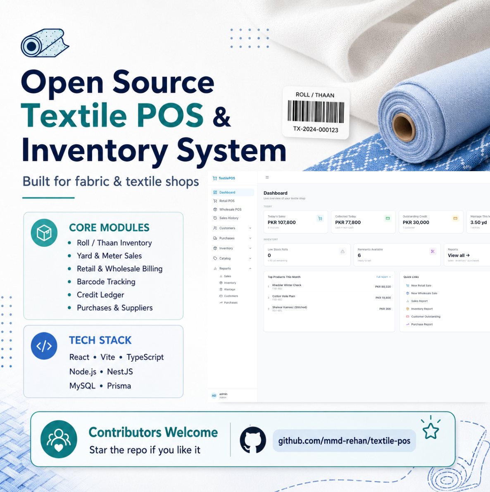
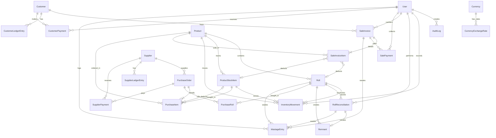

<div align="center">
  
</div>

<div align="center">

# TextilePOS

### *The Open-Source Textile ERP & POS system designed exclusively for fabric stores, resolving the continuous, variable-measurement inventory problem that breaks generic retail software.*

[](LICENSE)
[](https://www.typescriptlang.org/)
[](https://nestjs.com/)
[](https://react.dev/)
[](https://tailwindcss.com/)
[](https://www.prisma.io/)
[](https://www.mysql.com/)

[**Explore Docs**](file:///docs) • [**Report a Bug**](https://github.com/mmd-rehan/textile-pos/issues) • [**Request Feature**](https://github.com/mmd-rehan/textile-pos/issues) • [**Contribute**](#-contributing)

</div>

---

## 🧵 The Core Problem

Standard retail POS and ERP systems are built around a simple assumption: **discrete, countable units**. Selling 1 shirt, 3 mugs, or 12 bottles maps cleanly onto integer-based inventory counts. 

**Fabric and textile retail does not work this way.**

In a textile shop, inventory arrives in rolls (*Thaan*) of varying lengths (e.g., 30 yards). Fabric is cut and sold in variable, fractional lengths driven entirely by the customer's need: 3.2 yards for a suit, 5.5 meters for curtains, or 0.75 yards for a patch. This introduce a cascade of unique operational problems:

| Problem | Why Standard POS Fails | How TextilePOS Solves It |
| :--- | :--- | :--- |
| **Fractional Deductions** | Only supports whole-number quantities; floats introduce rounding errors. | Employs decimal-safe tracking to deduct exact fractional lengths (e.g., `3.25` yards) from a roll's running balance. |
| **Measurement Duality** | Rigid base units make conversions inaccurate and slow. | Supports dual-unit entry with automatic conversion (e.g., Yards ↔ Meters) per roll, maintaining exact balances. |
| **Dye-Lot & Batch Tracking** | Assumes same SKU means identical items. | Tracks stock at the `(Product, DyeLot, Roll)` grain to prevent selling mismatched color variants to the same customer. |
| **Roll Reconciliation** | Minor cutting errors build up, leaving ghost inventory. | Includes a structured reconciliation flow to retire exhausted rolls and log physical vs. system variances as shrinkage. |
| **Remnant Management** | Leftover scraps are either lost or sold at full price. | Automatically flags leftover scraps (e.g., under 2 yards) as remnants, applying separate discount and clearance workflows. |

---

## ✨ Features

- ⚡ **Continuous Fractional Ledger** — Accurate, append-only tracking of fabric lengths up to 4 decimal places with strict type validation.
- 🔄 **Real-time Unit Conversion** — Seamlessly intake rolls in meters and sell in yards, or vice-versa, with exact math.
- 🏷️ **Roll-level Barcode Generation** — Generate and print unique barcodes for each physical roll, linking it to its specific dye-lot, wholesale cost, and remaining length.
- 💱 **Multi-Currency Purchase Orders** — Document purchases from global suppliers in multiple currencies (USD, AED, EUR, PKR, etc.) while storing base-currency snapshots for inventory valuation.
- 📑 **Dual Sales POS (Retail vs. Wholesale)** — Separate interfaces and workflows optimized for fast retail scanning (with cash/discount modes) and bulk wholesale transactions (with customer ledger credit accounts).
- 📉 **Wastage & Shrinkage Tracking** — Track salesman cutting errors and roll end-of-life discrepancies, identifying where losses occur.
- 💳 **Udhaar (Credit) & Supplier Ledger** — Simple, append-only double-entry bookkeeping ledger to track credit customers and outstanding supplier balances.
- 🖨️ **Zero-Driver Thermal Printing** — Print standard 80mm thermal receipts directly from the browser using pure CSS `@media print` rules, optimized for fast checkout.
- 🔌 **HID Barcode Scanner Support** — Seamlessly handles USB/Bluetooth HID scanners without configuration by listening to browser keyboard streams.

---

## 🏛️ Architecture & Core Concepts

### 1. The Roll (Thaan) is the Atom of Inventory
In TextilePOS, inventory is **never** tracked solely at the product level. The **Roll (Thaan)** is the source of truth because every roll represents a physically distinct piece of fabric with its own batch number, dye lot, purchase cost, and remaining length.

```
Category (e.g., Fabric)
   └── Product (e.g., Lawn Summer Print)
         └── Batch / Dye Lot (e.g., Lot-24B)
               ├── Roll #1 (Thaan) -> 24.5 Yards Left
               └── Roll #2 (Thaan) -> 12.2 Yards Left
```

### 2. Product Types Supported
The system adapts its POS and purchase screens dynamically based on the product type:
- 🧵 **Variable-Length Fabric (`FABRIC_ROLL`)**: Sold in yards/meters from a specific roll barcode.
- ✂️ **Cut Pieces (`CUT_PIECE`)**: Pre-cut suits or fabrics sold by the piece/unit.
- 📦 **Fixed Products (`FIXED_PRODUCT`)**: Countable inventory (e.g., buttons, zippers, shawls) sold by the piece.

---

## 📊 Database Schema (Prisma ERD)

Below is the database relationship model. All transactions, stock movements, and ledgers are append-only to ensure complete auditing safety.



---

## 🛠️ Tech Stack

- **Frontend**: [React 18](https://react.dev/) + [Vite](https://vitejs.dev/) + [TypeScript](https://www.typescriptlang.org/) + [Tailwind CSS](https://tailwindcss.com/)
- **Backend**: [Node.js](https://nodejs.org/) + [NestJS](https://nestjs.com/) + [TypeScript](https://www.typescriptlang.org/)
- **Database**: [MySQL 8.0](https://www.mysql.com/)
- **ORM**: [Prisma](https://www.prisma.io/)
- **State Management**: [Zustand](https://github.com/pmndrs/zustand) (Client UI state) & [TanStack Query](https://tanstack.com/query/latest) (Server state)

---

## 🚀 Quick Start Guide

### Prerequisites
- [Node.js](https://nodejs.org/) (v18 or higher) and `npm`
- [Docker Desktop](https://www.docker.com/) (includes Docker Compose v2)
- A `bash`-compatible shell (macOS / Linux / WSL)

### One-command setup

```bash
git clone https://github.com/mmd-rehan/textile-pos.git
cd textile-pos
npm run setup
```

`npm run setup` runs `scripts/setup.sh`, which:
1. Checks prerequisites (`node`, `npm`, `docker`, `docker compose`).
2. Asks for any missing configuration (ports, db user, admin user, base currency, …).
3. Auto-picks the next free port if 3306 / 5001 / 5173 are already in use.
4. Generates random secrets for the DB password, MySQL root password, JWT, session, and (if you don't supply one) the admin password.
5. Writes `backend/.env`, `frontend/.env`, and `docker/.env` — preserving any unrelated keys you've already added.
6. Starts MySQL via `docker compose` and waits for the container to report healthy.
7. Installs npm workspaces, generates the Prisma client, runs `prisma migrate deploy`, and runs `prisma db seed`.

When it finishes, it prints the resolved service URLs and (if it generated an admin password) prints that password **once** — save it.

### Non-interactive setup with flags

Every interactive prompt has a matching flag, so the script can run fully unattended:

```bash
npm run setup -- \
  --mysql-port 3307 \
  --backend-port 5002 \
  --frontend-port 5174 \
  --db-name textile_pos \
  --db-user textile_user \
  --base-currency AED \
  --company-name "Al Noor Textile Trading" \
  --admin-username admin \
  --admin-email admin@example.com \
  --admin-password "Strong#Pass1" \
  --yes
```

`--yes` accepts safe defaults and generates secrets for anything still missing. Other useful flags:

| Flag | Effect |
| :--- | :--- |
| `--skip-install` | Skip `npm install`. |
| `--skip-docker`  | Don't start the MySQL container (use your own). |
| `--skip-migrate` | Don't apply Prisma migrations. |
| `--skip-seed`    | Don't run the seeder. |
| `--reset-admin-password` | Force-update an existing admin's password to `--admin-password`. |
| `--allow-root-db-user` | Permit `root` as the application DB user (not recommended — see below). |
| `--debug` | Verbose tracing (`set -x`). Never prints passwords or secrets. |

Run `npm run setup -- --help` for the full list.

> ℹ️  **Don't use `root` as the application DB user.** Use `textile_pos` (the default). If you pass `--db-user root`, setup warns and switches to `textile_pos` automatically — interactively it asks first. `--allow-root-db-user` overrides this; in that case the app connects as the real MySQL `root` account (the `mysql` image refuses to create a separate `root` user).

### What gets seeded

The seeder (`backend/prisma/seed.ts`) is **production-safe** and idempotent. It only seeds standard system data — no demo products, customers, suppliers, sales, purchases, or rolls:

- **Permissions** — `auth.me`, `users.manage`, `roles.manage`, `settings.manage`, `audit.view`, `products.manage`, `categories.manage`, `brands.manage`, `colors.manage`, `designs.manage`, `batches.manage`, `suppliers.manage`, `purchases.create/view/pay/attach_invoice/view_attachment/download_attachment`, `suppliers.view_statement`, `inventory.view/create_roll/adjust_stock/reconcile_roll`, `barcode.lookup/generate`, `sales.create_retail/create_wholesale/view/view_all`, `customers.manage/create_basic`, `ledger.view_customer/record_payment`, `wastage.view/create_manual/view_reports`, `remnants.view/manage`, `reports.view_sales/view_inventory/view_financial` (plus legacy `read:*` / `write:*` permissions still consumed by current auth guards).
- **Roles** — `Admin`, `Manager`, `Cashier`, `Inventory Staff`, `Accountant` (existing custom roles are not removed).
- **Currencies** — AED, PKR, USD, GBP, EUR, SAR, INR, CNY, TRY (with 1:1 self exchange rates only — no hard-coded cross rates).
- **Units** — Yard, Meter, Piece, Pack, Roll (+ Yard ↔ Meter conversions).
- **Company settings** — name, phone, email, address, base currency, timezone.
- **App settings** — invoice / PO / payment / barcode prefixes (`INV`, `WINV`, `PO`, `SPAY`, `CPAY`, `SRET`, `PRET`, `ROLL`, `TPOS`), tax defaults (`enabled=false`, `rate=0`, `label=VAT`), barcode format (`CODE128`), measurement defaults (base unit `YARD`, remnant threshold `2`, decimal precision `4`), and the allowed payment methods (`CASH`, `CARD`, `BANK_TRANSFER`, `CHEQUE`, `CREDIT`).
- **Feature flags** — `wholesalePos`, `barcodeGeneration`, `wastageTracking`, `remnantManagement`, `creditSales` (defaults applied only on first install — re-runs never overwrite an admin's choice).
- **Admin user** — created **only if no user with the Admin role exists**. Username, email, and password come from `SEED_ADMIN_*` env vars (written by `setup.sh`). To rotate the password later: re-run setup with `--reset-admin-password --admin-password "<new pw>"`.

### Environment files

`setup.sh` writes three files (all gitignored):

- `backend/.env` — `PORT`, `DATABASE_URL`, `JWT_SECRET`, `SESSION_SECRET`, `CORS_ORIGIN`, `STORAGE_PATH`, `BASE_CURRENCY_CODE`, `SEED_*`.
- `frontend/.env` — `VITE_API_URL`, `VITE_API_BASE_URL`, `VITE_BACKEND_PORT` (drives the Vite proxy).
- `docker/.env` — `MYSQL_DATABASE`, `MYSQL_USER`, `MYSQL_PASSWORD`, `MYSQL_ROOT_PASSWORD`, `MYSQL_PORT` (consumed by `docker/docker-compose.yml`).

Examples are checked in as `*.env.example`.

### Start the app

```bash
npm run dev
```

- **Frontend**: `http://localhost:<frontend-port>` (default 5173) — proxies `/api` to the backend.
- **Backend API**: `http://localhost:<backend-port>/api/v1` (default 5001).

Log in with the admin user created during setup.

### Useful database commands

```bash
npm run db:generate      # Regenerate the Prisma client after schema edits
npm run db:migrate       # prisma migrate dev — for local schema iteration
npm run db:deploy        # prisma migrate deploy — for shared / staging / prod DBs
npm run db:seed          # prisma db seed — re-run the standard seeder
```

> ⚠️  **Never** run `prisma db push` against a shared, staging, or production database. It rewrites the schema without producing a migration and will silently drop tables / columns. `db push` is only acceptable for throw-away local experiments. The standard flow is always `migrate dev` (locally) → commit the migration → `migrate deploy` (everywhere else).

### Troubleshooting

| Symptom | Fix |
| :--- | :--- |
| `Docker daemon reachable` check fails | Start Docker Desktop and re-run. |
| `Port 3306 (or 5001 / 5173) is busy. Using N instead.` | This is fine — setup auto-picks the next free port and writes it to `docker/.env` (`MYSQL_PORT`) and `backend/.env` (`DATABASE_URL`). To reuse 3306, stop the conflicting container first (e.g. `docker stop mysql`). To force a specific port, pass `--mysql-port`, `--backend-port` or `--frontend-port` (e.g. `npm run setup -- --mysql-port 3307`). |
| Another MySQL container already owns port 3306 | Safe — setup never stops, removes, or overwrites existing containers. It starts its own `textile_pos_db` on the next free host port. Either `docker stop mysql` to free 3306, or let setup pick 3307. |
| `MySQL did not become ready in time.` | `docker compose -f docker/docker-compose.yml logs db` for details. Most often: stale `mysql_data` volume from a previous setup — `docker compose -f docker/docker-compose.yml down -v` then re-run setup. |
| `Using 'root' as the application DB user is not recommended.` | Use `textile_pos`. Setup auto-switches under `--yes`; pass `--allow-root-db-user` only if you really need the app to connect as root. |
| `prisma migrate deploy` fails | `cd backend && npx prisma migrate status` shows the offending migration. Verify `DATABASE_URL` in `backend/.env` matches `docker/.env`. |
| `Admin user already exists.` after seed | Expected when re-running setup. Pass `--reset-admin-password --admin-password "<new pw>"` to rotate. |
| `Permission denied` running `scripts/setup.sh` | `chmod +x scripts/setup.sh` (or just call `bash scripts/setup.sh`). |

#### Default account

A single Admin user is created on first install:

| Username | Password | Role |
| :--- | :--- | :--- |
| `admin` (or `--admin-username`) | shown once at the end of setup (or whatever you passed via `--admin-password`) | **Admin** — full system access |

---

## 📜 Strict Project Rules & Design Decisions

To contribute to this project, you **MUST** align with the architectural guardrails established for Version 1. Any pull request violating these principles will be automatically rejected.

1. **v1 Single-Shop Scope** — Do not implement multi-branch routing, offline synchronization, mobile apps, RFID integrations, or native custom printer drivers. Keep it web-standard and localized to a single shop.
2. **Decimal-Safe Calculations** — **Floating-point math is strictly forbidden** for currencies and fabric measurements. Use `@prisma/client` Decimal types in the backend and precise decimal handling packages in the frontend to prevent rounding errors.
3. **Roll/Thaan Level Granularity** — Fabric inventory is roll-centric. Do not aggregate fabric stock only at the product level. Every cut must trace back to a specific `Roll` record.
4. **Backend as Source of Truth** — All inventory, financial ledger, and audit log writes must execute on the backend. The frontend is merely a presentation and math preview layer.
5. **Database Transaction Safety** — Any operation writing to multiple tables (e.g., saving a sale, checking out, paying a supplier, reconciling a roll) **must** run within a Prisma transaction (`$transaction`) to preserve ledger consistency.
6. **Append-Only Ledgers & Logs** — Confirmations of invoices, ledgers, stock movements, and audit logs are final. They must **never** be edited or deleted silently. Any adjustments must be done via correction records.
7. **Multi-Currency Purchases, Base-Currency Sales** — Purchases support multi-currency input (USD, EUR, AED, PKR, etc.) with manually input exchange rates. All retail and wholesale sales are logged in the global base currency (default: `PKR`).
8. **Thin Controllers, Rich Services** — NestJS controllers must stay thin. All validation, mathematical calculations, business rules, and transactional blocks belong inside NestJS service classes.

---

## 🤝 Contributing

We welcome contributions from developers, designers, testers, and textile business operators! 

To get started:
1. **Explore open issues** or open a new one to propose a feature or report a bug.
2. **Fork the repository** and create a descriptive branch: `git checkout -b feature/your-feature-name` or `bugfix/issue-id`.
3. **Align with the Domain Vocabulary** — Always name variables, databases, and comments using actual textile terminology (`roll`, `dyeLot`, `remnant`, `shrinkage`) rather than generic words (`item`, `lot`, `scraps`).
4. **Strict TypeScript compilation** — Ensure your code compiles without warnings and passes the linting tools.
5. **Submit a Pull Request** with a detailed explanation of your changes, referencing the relevant issues.

---

## 📄 License

This project is licensed under the **Apache 2.0 License** - see the [LICENSE](LICENSE) file for details.

---

<div align="center">
  <sub>Built with ❤️ for fabric and textile shop owners who have been running inventory on paper because software never understood their trade.</sub>
</div>
