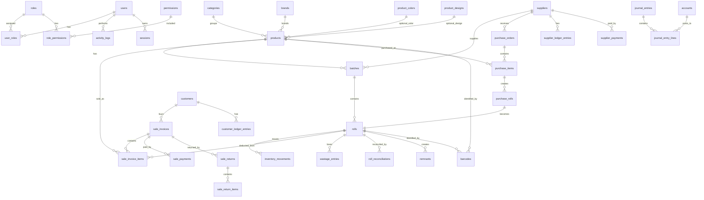

# Database ERD

## Purpose

This document defines the first logical database model for the Textile ERP & POS System.

The goal is to describe the main entities, relationships, and data ownership rules before writing the actual Prisma schema.

## Status

Draft for implementation planning.

This ERD is intentionally practical for v1 single-shop usage. It keeps future multi-branch support in mind, but does not implement multi-branch tables yet.

## Confirmed Technology Direction

- Database: MySQL
- ORM: Prisma
- Backend: Node.js + NestJS
- Frontend: Next.js + React + TypeScript, with Vite preference where applicable
- Current deployment model: single shop, web-based system

## Core Database Principle

Inventory must be tracked at roll level, not only product level.

A product can have many batches.
A batch can have many rolls.
A roll is the true stock unit for variable-length fabric.

```text
Category
  -> Product
    -> Batch / Dye Lot
      -> Roll / Thaan
        -> Inventory Movement
        -> Sale Item
        -> Wastage / Reconciliation
```

## Entity Groups

### 1. Access Control

| Entity | Purpose |
|---|---|
| users | System login users such as admin, manager, cashier, inventory staff, accountant |
| roles | Role definitions |
| permissions | Fine-grained permission keys |
| user_roles | Mapping between users and roles |
| role_permissions | Mapping between roles and permissions |
| sessions | Login sessions or refresh-token records, depending on final auth implementation |
| activity_logs | User actions useful for security and operational tracking |

### 2. Product Catalog

| Entity | Purpose |
|---|---|
| categories | Fabric and product grouping, for example Palachi, Cotton, Shawls |
| brands | Optional brand/manufacturer grouping |
| products | Sellable item definition |
| product_colors | Optional color master data |
| product_designs | Optional design/pattern master data |
| units | Units such as yard, meter, piece |
| unit_conversions | Conversion rules, for example meter to yard |

### 3. Inventory Engine

| Entity | Purpose |
|---|---|
| batches | Product batch, supplier batch, or dye lot |
| rolls | Individual fabric rolls/thaan |
| inventory_movements | Immutable movement ledger for purchase, sale, return, adjustment, wastage, and reconciliation |
| stock_adjustments | Manual stock correction request and approval record |
| wastage_entries | Records over-cutting and fabric loss |
| roll_reconciliations | Roll retirement and physical-vs-system reconciliation |
| remnants | Small leftover pieces moved into remnant/chant inventory |

### 4. Sales

| Entity | Purpose |
|---|---|
| customers | Retail, wholesale, and credit customers |
| sale_invoices | Retail or wholesale invoice header |
| sale_invoice_items | Invoice line items |
| sale_payments | Payments collected against invoices |
| sale_returns | Return/refund header |
| sale_return_items | Return/refund line details |

### 5. Customer Ledger

| Entity | Purpose |
|---|---|
| customer_ledger_entries | Customer debit/credit ledger entries |
| customer_credit_limits | Optional credit limit rules if separated from customers |

For v1, credit limit may remain directly on `customers` unless complexity increases.

### 6. Purchases and Suppliers

| Entity | Purpose |
|---|---|
| suppliers | Supplier profiles |
| purchase_orders | Purchase header or purchase entry |
| purchase_items | Product/batch-level purchase lines |
| purchase_rolls | Roll-level details created from purchase items |
| supplier_ledger_entries | Supplier payable ledger entries |
| supplier_payments | Payments made to suppliers |

### 7. Accounting and Expenses

| Entity | Purpose |
|---|---|
| accounts | Chart of accounts |
| journal_entries | Accounting transaction header |
| journal_entry_lines | Debit and credit lines |
| expenses | Expense records |
| cash_register_sessions | Optional cashier opening/closing session records |

Accounting is included as an ERP foundation, but some areas remain pending until accounting rules are finalized.

### 8. Barcode and Printing

| Entity | Purpose |
|---|---|
| barcodes | Generated barcode records for rolls and products |
| print_jobs | Optional print history for labels and receipts |

For v1, scanner input is treated like keyboard input in the browser. Receipt printing is browser-based direct print where supported.

### 9. Settings and Configuration

| Entity | Purpose |
|---|---|
| company_settings | Company/shop identity, invoice defaults, measurement defaults |
| app_settings | Key-value settings for configurable behavior |
| feature_flags | Enable or disable optional modules safely |

## Logical ERD



## Core Tables and Suggested Fields

### users

| Field | Type | Notes |
|---|---|---|
| id | String | Prisma-generated ID. Exact generator pending confirmation. |
| full_name | String | Required |
| username | String | Unique, optional if email is used |
| email | String | Unique, optional if username is used |
| password_hash | String | Never store raw password |
| status | Enum | ACTIVE, INACTIVE, SUSPENDED |
| created_at | DateTime | Required |
| updated_at | DateTime | Required |

### products

| Field | Type | Notes |
|---|---|---|
| id | String | Primary key |
| category_id | String | Required |
| brand_id | String | Optional |
| product_code | String | Unique or scoped unique, pending confirmation |
| name | String | Required |
| product_type | Enum | FABRIC_ROLL, CUT_PIECE, FIXED_PRODUCT |
| default_unit_id | String | Yard, meter, piece |
| retail_price | Decimal | Optional default |
| wholesale_price | Decimal | Optional default |
| status | Enum | ACTIVE, INACTIVE, DISCONTINUED |
| created_at | DateTime | Required |
| updated_at | DateTime | Required |

### batches

| Field | Type | Notes |
|---|---|---|
| id | String | Primary key |
| product_id | String | Required |
| supplier_id | String | Optional |
| batch_no | String | Internal batch number |
| supplier_batch_no | String | Optional supplier batch |
| dye_lot_no | String | Optional dye lot number |
| received_date | Date | Optional |
| notes | String | Optional |
| created_at | DateTime | Required |

### rolls

| Field | Type | Notes |
|---|---|---|
| id | String | Primary key |
| roll_code | String | Unique human-readable code, for example R-1001 |
| barcode_value | String | Unique barcode value |
| product_id | String | Required for fast lookup |
| batch_id | String | Required for dye lot tracking |
| supplier_id | String | Optional shortcut, also derivable from purchase |
| original_length | Decimal | Required |
| remaining_length | Decimal | Required |
| unit_id | String | Required. Prefer storing base unit consistently. |
| purchase_price_per_unit | Decimal | Optional |
| sale_price_per_unit | Decimal | Optional |
| status | Enum | AVAILABLE, LOW_STOCK, REMNANT, FINISHED, RETIRED, DAMAGED |
| purchase_date | Date | Optional |
| created_at | DateTime | Required |
| updated_at | DateTime | Required |

### inventory_movements

This is the core traceability table.

| Field | Type | Notes |
|---|---|---|
| id | String | Primary key |
| roll_id | String | Required for roll-based products |
| product_id | String | Required for product-level reporting |
| movement_type | Enum | PURCHASE, SALE, RETURN, ADJUSTMENT, WASTAGE, RECONCILIATION, REMNANT |
| direction | Enum | IN, OUT, NEUTRAL |
| quantity | Decimal | Movement quantity in stored/base unit |
| unit_id | String | Unit used for stored quantity |
| before_quantity | Decimal | Roll length before movement |
| after_quantity | Decimal | Roll length after movement |
| reference_type | String | SALE_INVOICE, PURCHASE_ORDER, etc. |
| reference_id | String | ID of source document |
| user_id | String | Actor |
| reason | String | Optional or required based on type |
| created_at | DateTime | Required |

### sale_invoices

| Field | Type | Notes |
|---|---|---|
| id | String | Primary key |
| invoice_no | String | Unique invoice number |
| sale_type | Enum | RETAIL, WHOLESALE |
| customer_id | String | Optional for walk-in retail |
| subtotal | Decimal | Required |
| discount_total | Decimal | Required, default 0 |
| tax_total | Decimal | Pending tax confirmation |
| grand_total | Decimal | Required |
| paid_total | Decimal | Required |
| balance_due | Decimal | Required |
| payment_status | Enum | UNPAID, PARTIAL, PAID, CREDIT |
| invoice_status | Enum | DRAFT, CONFIRMED, CANCELLED, RETURNED |
| created_by_id | String | Required |
| created_at | DateTime | Required |

### sale_invoice_items

| Field | Type | Notes |
|---|---|---|
| id | String | Primary key |
| invoice_id | String | Required |
| product_id | String | Required |
| batch_id | String | Optional for non-roll products, required for roll fabric |
| roll_id | String | Required for roll fabric |
| billed_quantity | Decimal | Quantity charged to customer |
| actual_cut_quantity | Decimal | Quantity deducted from inventory |
| unit_id | String | Unit entered by user |
| base_quantity | Decimal | Converted quantity for inventory math |
| price_per_unit | Decimal | Required |
| line_total | Decimal | Required |
| wastage_quantity | Decimal | actual_cut - billed_quantity, if positive |
| created_at | DateTime | Required |

### customer_ledger_entries

| Field | Type | Notes |
|---|---|---|
| id | String | Primary key |
| customer_id | String | Required |
| entry_type | Enum | INVOICE, PAYMENT, RETURN, ADJUSTMENT |
| debit | Decimal | Amount customer owes |
| credit | Decimal | Amount customer paid or credited |
| balance_after | Decimal | Running balance after entry |
| reference_type | String | SALE_INVOICE, SALE_PAYMENT, etc. |
| reference_id | String | Source record |
| notes | String | Optional |
| created_by_id | String | Required |
| created_at | DateTime | Required |

## Measurement Storage Rule

All length calculations should be stored in a consistent base unit.

Recommended v1 approach:

- Store fabric inventory in yards as the base length unit.
- Store the user-entered unit separately on transaction lines.
- Store the converted base quantity on transaction lines.

Pending confirmation:

- Whether shop default base unit should be yards or meters.

Because the source examples mostly use yards and the conversion example provides meter-to-yard conversion, yards are documented as the recommended v1 base unit.

## Decimal Precision Guidelines

| Value Type | Recommended Prisma/MySQL Type | Notes |
|---|---|---|
| Money | Decimal(12, 2) | AED/PKR-style currency values |
| Fabric length | Decimal(10, 3) | Supports 3.125 yards, 2.750 meters |
| Quantity count | Decimal(12, 3) | Supports piece and fractional quantity if needed |
| Percentage | Decimal(5, 2) | Discounts, tax rates |

Never use floating point types for money or fabric measurement.

## Pending Confirmations

The following should not be locked until confirmed:

1. ID generator strategy: cuid, uuid, or auto-increment integer.
2. Exact tax/VAT/GST behavior.
3. Exact invoice numbering format.
4. Whether all fabric length should be stored in yards or meters.
5. Whether remnant threshold is always 2 yards or configurable.
6. Whether branch/company tables are excluded fully from v1 or added as inactive future-ready tables.
7. Whether accounting should be fully double-entry in v1 or phased after POS and inventory.
